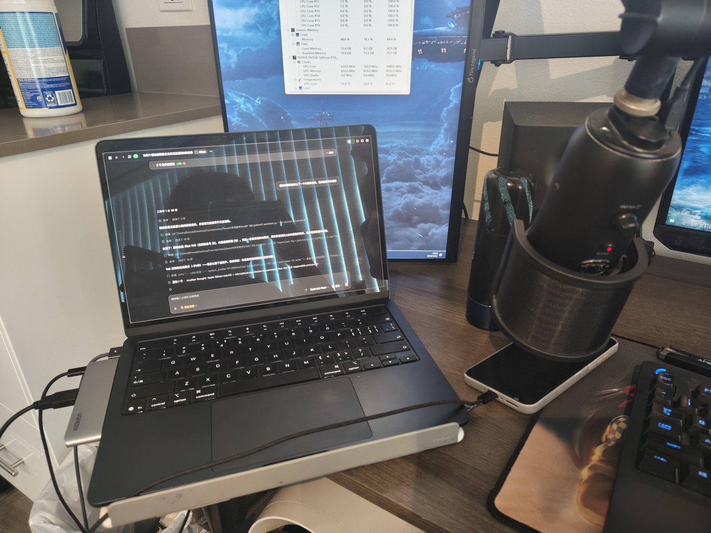

# AI Call Assistant (Specialized for OPPO-series phones + MacBook)

[中文](README.md) | English

> **This project was created and debugged by ZCode (coding agent, model GLM-5.3-Flash).**

When an incoming call goes unanswered for 10 seconds, it is automatically picked up. A customizable multi-language greeting (including a recording notice) is played to the caller, who is invited to leave a message that gets recorded. After hang-up, transcription and AI summarization run entirely on your machine. **Never relies on carrier voicemail; zero installation on the phone** (USB + ADB only).

> **⚠️ Scope note**: this project is a specialized pipeline for **OPPO-series phones (incl. OnePlus, ColorOS/OxygenOS) + MacBook laptops (Apple Silicon)**.
> - Auto-answer relies on ADB `input keyevent`, verified on a **OnePlus Ace 5 Ultra (ColorOS 15)**; other OPPO/OnePlus models need their own verification;
> - It depends on ColorOS's "USB debugging (Security settings)" toggle to simulate key presses — other systems have no equivalent;
> - The audio chain (speaker/mic placement, level calibration, Blue Yeti microphone) was built on a **MacBook Air**;
> - Other phone brands or Windows/Linux computers can adapt the architecture; the core limitation (Android does not expose the call audio stream) is universal.

## Software versions (verified combination, tested 2026-09-22)

| Component | Verified version |
|---|---|
| macOS (MacBook Air) | **26.6.2** (Build 25G83) |
| ColorOS (OnePlus Ace 5 Ultra, PLC110) | **V16.1.0** (Android 16, build `PLC110_16.0.10.500(CN01)`) |
| O+ Connect (optional) | Mac **16.2.10** / phone **16.25.6** (`com.oplus.linker`) |
| Python | 3.14 (mlx-whisper runs on 3.14.7) |
| adb | 37.0.1 (homebrew android-platform-tools) |
| ffmpeg | 9.0.2 (requires the `afftdn` / `arnndn` / `speechnorm` filters) |
| Transcription | mlx-whisper 0.4.3 + `mlx-community/whisper-medium-mlx` |
| Summarization | ollama + `qwen2.5:7b-instruct-q4_K_M` (4.7 GB) |

> Version-sensitive points: the location of ColorOS's "USB debugging (Security settings)" toggle; the field format of `dumpsys telephony.registry`; macOS's per-app microphone permission for terminal apps (macOS returns silence instead of an error). O+ Connect is only used for screen mirroring and manual takeover — it is optional and not required for auto-answering.

## How it works

```
OnePlus phone (USB/adb)                 MacBook Air
┌──────────────────┐     dumpsys      ┌───────────────────────────────────┐
│ Stock OS, zero    │◄────────────────►│ assistant.py state machine        │
│ installation      │     keyevent     │ ring detect → policy → auto-answer│
└────────┬─────────┘                  │ after 10 s → greeting → beep →    │
         │ acoustic                   │ record → on hang-up: Whisper →    │
         ▼                            │ LLM summary → transcripts/summaries│
   Mac speakers ──→ phone mic (uplink)│                                   │
   phone earpiece ──→ ext. mic ──→ Mac│                                   │
                                      └───────────────────────────────────┘
```

Key design points:

- **Half-duplex recording**: recording starts only after the greeting finishes playing, which eliminates the need for echo cancellation by construction;
- **Call volume auto-maximized**: after answering, "volume up" is pressed repeatedly so the earpiece output is loud enough for the recording channel to pick up;
- **Voice-band filtering**: recordings are band-passed 80–3800 Hz in real time to suppress low-frequency rumble and high-frequency hiss;
- **Local-first**: transcription (mlx-whisper) and summarization (ollama) run entirely on the machine — no cloud dependency.

## Real deployment



In the photo: the **MacBook Air** runs `assistant.py` (a USB cable through a hub connects the phone, providing both power and ADB); the **Blue Yeti** sits on a boom arm with a shock mount, its pickup facing the earpiece slit at the top of the flat-laid **OnePlus phone** (recording channel); the phone's bottom edge (microphone) points toward the MacBook speakers (greeting channel).

## Repository layout

```
├── README.md            # Chinese readme
├── README.en.md         # This file
├── TODO.md              # Roadmap: conversational upgrade + deep phone-OS privileges for fully-muted operation (bilingual)
└── code/
    ├── assistant.py         # Main program (single file, Python ≥3.9)
    ├── config.example.json  # Sample configuration
    └── README.md            # Install, config, commands, troubleshooting (code docs, Chinese)
```

> Design research and deployment documents (feasibility analysis / deployment plan / computer-based walkthrough) are kept locally only and are not committed.

## Quick start

Full steps in [code/README.md](code/README.md) (Chinese). In short:

```bash
brew install --cask android-platform-tools ffmpeg
brew install ollama && brew services start ollama
pipx install mlx-whisper        # optional; without it, recordings are still saved

cp code/config.example.json code/config.json
python3 code/assistant.py --check        # environment self-check
python3 code/assistant.py --record-test  # recording-channel calibration
python3 code/assistant.py                # run persistently
```

## Privacy

This repository contains **no** call recordings, logs, greeting audio, or personal configuration (see `.gitignore`):

- `recordings/ transcripts/ summaries/ logs/` — produced at runtime, contain personal call content;
- `greetings/` — greeting audio, contains personal information (e.g. time zone / call-back hours); generate it locally per the code README;
- `config.json` — personal configuration; copy from `config.example.json` on first use.

Recording notice: the greeting text includes a "your message will be recorded" notice; recordings and summaries are stored locally only.

## Goal & status

**Goal**: a laptop + one Android phone forming an "AI secretary" that automatically answers calls while you're away, plays a greeting, collects messages, and produces summaries.

**Status** (2026-09-22): the full single-machine pipeline has been verified on real hardware (OnePlus Ace 5 Ultra + MacBook Air + Blue Yeti) — call detection, 10-second auto-answer, greeting playback and message recording all work; **transcription (mlx-whisper medium) and local summarization (ollama + qwen2.5-7B) are installed and tested end-to-end**; recording SNR keeps improving through RNNoise neural denoising and placement tuning.
